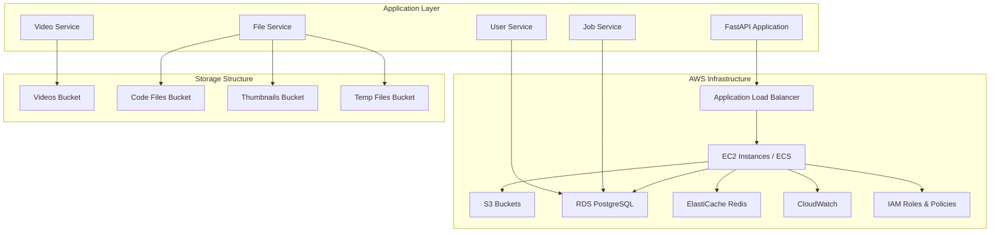

# Design Document

## Overview

This design outlines the migration of the video generation application from local file storage and Redis-based data management to a comprehensive AWS cloud infrastructure. The solution leverages AWS S3 for scalable file storage with versioning capabilities and AWS RDS for persistent relational data storage. The design ensures high availability, security, and cost-effectiveness while maintaining compatibility with the existing application architecture.

## Architecture

### High-Level Architecture



### Environment Separation

- **Development**: `dev-` prefixed resources
- **Staging**: `staging-` prefixed resources  
- **Production**: `prod-` prefixed resources

## Components and Interfaces

### S3 Storage Architecture

#### Bucket Structure
- **Videos Bucket**: `{env}-t2m-videos-{region}-{account-id}`
  - Path structure: `users/{user_id}/jobs/{job_id}/videos/{scene_number}/`
  - Versioning enabled for video files
  - Lifecycle policies for cost optimization
  
- **Code Files Bucket**: `{env}-t2m-code-{region}-{account-id}`
  - Path structure: `users/{user_id}/jobs/{job_id}/code/{scene_number}/`
  - Versioning enabled for code tracking
  
- **Thumbnails Bucket**: `{env}-t2m-thumbnails-{region}-{account-id}`
  - Path structure: `users/{user_id}/jobs/{job_id}/thumbnails/{scene_number}/`
  - Optimized for frequent access
  
- **Temp Files Bucket**: `{env}-t2m-temp-{region}-{account-id}`
  - Path structure: `temp/{session_id}/{timestamp}/`
  - Lifecycle policy for automatic cleanup after 7 days

#### S3 Configuration Features
- **Versioning**: Enabled on all buckets for data integrity
- **Encryption**: AES-256 server-side encryption
- **Access Logging**: Enabled for audit trails
- **Cross-Region Replication**: For production critical data
- **Intelligent Tiering**: For cost optimization

### RDS Database Design

#### Database Schema
```sql
-- Users table
CREATE TABLE users (
    id UUID PRIMARY KEY DEFAULT gen_random_uuid(),
    clerk_user_id VARCHAR(255) UNIQUE NOT NULL,
    email VARCHAR(255) NOT NULL,
    role VARCHAR(50) DEFAULT 'user',
    created_at TIMESTAMP DEFAULT CURRENT_TIMESTAMP,
    updated_at TIMESTAMP DEFAULT CURRENT_TIMESTAMP,
    metadata JSONB
);

-- Jobs table
CREATE TABLE jobs (
    id UUID PRIMARY KEY DEFAULT gen_random_uuid(),
    user_id UUID REFERENCES users(id),
    status VARCHAR(50) NOT NULL,
    priority VARCHAR(20) DEFAULT 'normal',
    topic VARCHAR(255) NOT NULL,
    description TEXT,
    configuration JSONB,
    progress_percentage DECIMAL(5,2) DEFAULT 0,
    current_stage VARCHAR(100),
    error_info JSONB,
    metrics JSONB,
    created_at TIMESTAMP DEFAULT CURRENT_TIMESTAMP,
    updated_at TIMESTAMP DEFAULT CURRENT_TIMESTAMP,
    estimated_completion TIMESTAMP,
    batch_id UUID
);

-- File metadata table
CREATE TABLE file_metadata (
    id UUID PRIMARY KEY DEFAULT gen_random_uuid(),
    user_id UUID REFERENCES users(id),
    job_id UUID REFERENCES jobs(id),
    file_type VARCHAR(50) NOT NULL,
    original_filename VARCHAR(255),
    s3_bucket VARCHAR(255) NOT NULL,
    s3_key VARCHAR(500) NOT NULL,
    file_size BIGINT,
    content_type VARCHAR(100),
    version_id VARCHAR(255),
    metadata JSONB,
    created_at TIMESTAMP DEFAULT CURRENT_TIMESTAMP
);

-- Job queue table
CREATE TABLE job_queue (
    id UUID PRIMARY KEY DEFAULT gen_random_uuid(),
    job_id UUID REFERENCES jobs(id),
    priority VARCHAR(20) DEFAULT 'normal',
    status VARCHAR(50) DEFAULT 'queued',
    queued_at TIMESTAMP DEFAULT CURRENT_TIMESTAMP,
    processing_started_at TIMESTAMP,
    completed_at TIMESTAMP
);
```

#### RDS Configuration
- **Engine**: PostgreSQL 15.x
- **Instance Class**: db.t3.medium (dev), db.r6g.large (prod)
- **Multi-AZ**: Enabled for production
- **Backup Retention**: 7 days (dev), 30 days (prod)
- **Encryption**: Enabled at rest and in transit
- **Connection Pooling**: Using RDS Proxy

### Service Integration Updates

#### FileService Integration
```python
import boto3
from botocore.exceptions import ClientError
from boto3.s3.transfer import TransferConfig
from concurrent.futures import ThreadPoolExecutor
import asyncio
from typing import Optional

class AWSS3FileService:
    def __init__(self, aws_config: dict):
        # Create session for thread safety
        self.session = boto3.Session(
            aws_access_key_id=aws_config['access_key_id'],
            aws_secret_access_key=aws_config['secret_access_key'],
            region_name=aws_config['region']
        )
        self.s3_client = self.session.client('s3')
        self.buckets = aws_config['buckets']
        
        # Configure transfer settings for optimal performance
        self.transfer_config = TransferConfig(
            multipart_threshold=1024 * 25,  # 25MB
            max_concurrency=10,
            multipart_chunksize=1024 * 25,
            use_threads=True
        )
    
    async def upload_file(self, file: UploadFile, user_id: str, 
                         file_type: str, job_id: str = None) -> dict:
        """Upload file to S3 with proper error handling and metadata"""
        bucket = self._get_bucket_for_type(file_type)
        key = self._generate_s3_key(user_id, job_id, file.filename, file_type)
        
        # Prepare metadata
        extra_args = {
            'Metadata': {
                'user_id': user_id,
                'job_id': job_id or '',
                'file_type': file_type,
                'upload_timestamp': str(datetime.utcnow()),
                'original_filename': file.filename
            },
            'ContentType': file.content_type or 'application/octet-stream'
        }
        
        try:
            # Use asyncio to run the blocking S3 operation
            loop = asyncio.get_event_loop()
            with ThreadPoolExecutor() as executor:
                await loop.run_in_executor(
                    executor,
                    self._upload_with_retry,
                    file.file, bucket, key, extra_args
                )
            
            # Store metadata in RDS
            file_metadata = await self._store_file_metadata(
                user_id, job_id, file_type, file.filename, 
                bucket, key, file.size, extra_args['Metadata']
            )
            
            return {
                'file_id': file_metadata.id,
                's3_url': f"s3://{bucket}/{key}",
                'download_url': self.generate_presigned_url(bucket, key)
            }
            
        except ClientError as e:
            error_code = e.response['Error']['Code']
            if error_code == 'NoSuchBucket':
                raise ValueError(f"Bucket {bucket} does not exist")
            elif error_code == 'AccessDenied':
                raise PermissionError(f"Access denied to bucket {bucket}")
            else:
                raise RuntimeError(f"S3 upload failed: {e}")
    
    def _upload_with_retry(self, file_obj, bucket: str, key: str, extra_args: dict):
        """Upload with automatic retry logic"""
        max_retries = 3
        for attempt in range(max_retries):
            try:
                self.s3_client.upload_fileobj(
                    file_obj, bucket, key, 
                    ExtraArgs=extra_args,
                    Config=self.transfer_config
                )
                return
            except ClientError as e:
                if attempt == max_retries - 1:
                    raise
                time.sleep(2 ** attempt)  # Exponential backoff
    
    def generate_presigned_url(self, bucket: str, key: str, expiration: int = 3600) -> str:
        """Generate presigned URL for secure file access"""
        try:
            response = self.s3_client.generate_presigned_url(
                'get_object',
                Params={'Bucket': bucket, 'Key': key},
                ExpiresIn=expiration
            )
            return response
        except ClientError as e:
            raise RuntimeError(f"Failed to generate presigned URL: {e}")
```

#### VideoService Integration
```python
import os
import logging
from pathlib import Path

class AWSVideoService:
    def __init__(self, aws_config: dict, db_session):
        self.session = boto3.Session(
            aws_access_key_id=aws_config['access_key_id'],
            aws_secret_access_key=aws_config['secret_access_key'],
            region_name=aws_config['region']
        )
        self.s3_client = self.session.client('s3')
        self.db_session = db_session
        self.buckets = aws_config['buckets']
        
        # Configure for large video files
        self.video_transfer_config = TransferConfig(
            multipart_threshold=1024 * 50,  # 50MB for videos
            max_concurrency=8,
            multipart_chunksize=1024 * 50,
            use_threads=True
        )
    
    async def store_rendered_video(self, video_path: str, job_id: str, 
                                  scene_number: int, user_id: str) -> dict:
        """Store rendered video in S3 with comprehensive metadata"""
        bucket = self.buckets['videos']
        key = f"users/{user_id}/jobs/{job_id}/videos/scene_{scene_number:03d}/output.mp4"
        
        # Get video file info
        video_stats = os.stat(video_path)
        file_size = video_stats.st_size
        
        # Prepare metadata
        extra_args = {
            'Metadata': {
                'user_id': user_id,
                'job_id': job_id,
                'scene_number': str(scene_number),
                'file_type': 'video',
                'content_type': 'video/mp4',
                'upload_timestamp': str(datetime.utcnow()),
                'file_size': str(file_size)
            },
            'ContentType': 'video/mp4'
        }
        
        try:
            # Upload with progress tracking
            progress_callback = ProgressPercentage(video_path, job_id, scene_number)
            
            loop = asyncio.get_event_loop()
            with ThreadPoolExecutor() as executor:
                await loop.run_in_executor(
                    executor,
                    self._upload_video_with_callback,
                    video_path, bucket, key, extra_args, progress_callback
                )
            
            # Store video metadata in database
            video_metadata = await self._store_video_metadata(
                user_id, job_id, scene_number, bucket, key, file_size
            )
            
            # Generate thumbnail if needed
            thumbnail_url = await self._generate_video_thumbnail(
                bucket, key, user_id, job_id, scene_number
            )
            
            return {
                'video_id': video_metadata.id,
                's3_url': f"s3://{bucket}/{key}",
                'streaming_url': self._generate_cloudfront_url(key),
                'thumbnail_url': thumbnail_url,
                'file_size': file_size
            }
            
        except Exception as e:
            logging.error(f"Failed to store video {video_path}: {e}")
            raise RuntimeError(f"Video storage failed: {e}")
    
    def _upload_video_with_callback(self, video_path: str, bucket: str, 
                                   key: str, extra_args: dict, callback):
        """Upload video with progress callback"""
        self.s3_client.upload_file(
            video_path, bucket, key,
            ExtraArgs=extra_args,
            Config=self.video_transfer_config,
            Callback=callback
        )
    
    async def get_video_stream_url(self, video_id: str, user_id: str) -> str:
        """Generate secure streaming URL for video playback"""
        # Get video metadata from database
        video_metadata = await self._get_video_metadata(video_id, user_id)
        
        if not video_metadata:
            raise ValueError(f"Video {video_id} not found for user {user_id}")
        
        # Generate presigned URL with longer expiration for streaming
        return self.s3_client.generate_presigned_url(
            'get_object',
            Params={'Bucket': video_metadata.s3_bucket, 'Key': video_metadata.s3_key},
            ExpiresIn=7200  # 2 hours for video streaming
        )

class ProgressPercentage:
    """Progress callback for video uploads"""
    def __init__(self, filename: str, job_id: str, scene_number: int):
        self._filename = filename
        self._size = float(os.path.getsize(filename))
        self._seen_so_far = 0
        self._lock = threading.Lock()
        self.job_id = job_id
        self.scene_number = scene_number
    
    def __call__(self, bytes_amount):
        with self._lock:
            self._seen_so_far += bytes_amount
            percentage = (self._seen_so_far / self._size) * 100
            
            # Update job progress in database
            # This could be enhanced to update job status in real-time
            logging.info(
                f"Video upload progress - Job: {self.job_id}, "
                f"Scene: {self.scene_number}, Progress: {percentage:.2f}%"
            )
```

## Data Models

### Updated Service Models

#### Job Model Updates
```python
from sqlalchemy import Column, String, DateTime, JSON, Decimal, ForeignKey
from sqlalchemy.dialects.postgresql import UUID
import uuid

class Job(Base):
    __tablename__ = 'jobs'
    
    id = Column(UUID(as_uuid=True), primary_key=True, default=uuid.uuid4)
    user_id = Column(UUID(as_uuid=True), ForeignKey('users.id'), nullable=False)
    status = Column(String(50), nullable=False)
    priority = Column(String(20), default='normal')
    topic = Column(String(255), nullable=False)
    description = Column(Text)
    configuration = Column(JSON)
    progress_percentage = Column(Decimal(5,2), default=0)
    current_stage = Column(String(100))
    error_info = Column(JSON)
    metrics = Column(JSON)
    created_at = Column(DateTime, default=datetime.utcnow)
    updated_at = Column(DateTime, default=datetime.utcnow, onupdate=datetime.utcnow)
    estimated_completion = Column(DateTime)
    batch_id = Column(UUID(as_uuid=True))
```

#### File Metadata Model
```python
class FileMetadata(Base):
    __tablename__ = 'file_metadata'
    
    id = Column(UUID(as_uuid=True), primary_key=True, default=uuid.uuid4)
    user_id = Column(UUID(as_uuid=True), ForeignKey('users.id'), nullable=False)
    job_id = Column(UUID(as_uuid=True), ForeignKey('jobs.id'))
    file_type = Column(String(50), nullable=False)
    original_filename = Column(String(255))
    s3_bucket = Column(String(255), nullable=False)
    s3_key = Column(String(500), nullable=False)
    file_size = Column(BigInteger)
    content_type = Column(String(100))
    version_id = Column(String(255))
    metadata = Column(JSON)
    created_at = Column(DateTime, default=datetime.utcnow)
```

## Error Handling

### S3 Error Handling Strategy
```python
import boto3
from botocore.exceptions import ClientError, NoCredentialsError
import asyncio
from tenacity import retry, stop_after_attempt, wait_exponential

class S3ErrorHandler:
    @retry(
        stop=stop_after_attempt(3),
        wait=wait_exponential(multiplier=1, min=4, max=10)
    )
    async def upload_with_retry(self, file_path, bucket, key):
        try:
            await self.s3_client.upload_file(file_path, bucket, key)
        except ClientError as e:
            error_code = e.response['Error']['Code']
            if error_code == 'NoSuchBucket':
                raise ValueError(f"Bucket {bucket} does not exist")
            elif error_code == 'AccessDenied':
                raise PermissionError(f"Access denied to bucket {bucket}")
            else:
                raise
        except NoCredentialsError:
            raise ValueError("AWS credentials not configured")
```

### RDS Connection Management
```python
from sqlalchemy.pool import QueuePool
from sqlalchemy.exc import DisconnectionError
import logging

class RDSConnectionManager:
    def __init__(self, database_url):
        self.engine = create_async_engine(
            database_url,
            poolclass=QueuePool,
            pool_size=20,
            max_overflow=30,
            pool_pre_ping=True,
            pool_recycle=3600
        )
    
    async def get_session(self):
        try:
            async with AsyncSession(self.engine) as session:
                yield session
        except DisconnectionError:
            logging.warning("Database connection lost, reconnecting...")
            await self.engine.dispose()
            async with AsyncSession(self.engine) as session:
                yield session
```

## Testing Strategy

### Unit Testing
- Mock AWS services using `moto` library for S3 and RDS testing
- Test service layer integration with AWS clients
- Validate data model migrations and schema changes

### Integration Testing
- Test end-to-end file upload and retrieval workflows
- Validate database operations with real RDS instances
- Test error handling and retry mechanisms

### Performance Testing
- Load testing for concurrent file uploads
- Database performance testing under high load
- S3 transfer optimization validation

### Security Testing
- IAM policy validation
- Encryption verification for data at rest and in transit
- Access control testing for different user roles

## Deployment and Migration Strategy

### Phase 1: Infrastructure Setup
1. Create AWS resources using Infrastructure as Code (Terraform)
2. Set up monitoring and logging
3. Configure security policies and IAM roles

### Phase 2: Service Migration
1. Deploy updated services with dual-write capability
2. Migrate existing data from local storage to S3
3. Migrate Redis data to RDS
4. Validate data integrity

### Phase 3: Cutover and Cleanup
1. Switch to AWS-only operations
2. Remove local storage dependencies
3. Clean up temporary migration resources
4. Monitor system performance and stability
### AWS C
onfiguration Management

#### Environment Configuration
```python
import os
from typing import Dict, Any
from dataclasses import dataclass

@dataclass
class AWSConfig:
    """AWS configuration for different environments"""
    access_key_id: str
    secret_access_key: str
    region: str
    buckets: Dict[str, str]
    rds_endpoint: str
    rds_database: str
    rds_username: str
    rds_password: str
    environment: str

class AWSConfigManager:
    """Manages AWS configuration across environments"""
    
    @staticmethod
    def load_config(environment: str = None) -> AWSConfig:
        """Load AWS configuration from environment variables"""
        env = environment or os.getenv('ENVIRONMENT', 'development')
        
        # Bucket naming convention: {env}-t2m-{type}-{region}-{account-id}
        region = os.getenv('AWS_REGION', 'us-east-1')
        account_id = os.getenv('AWS_ACCOUNT_ID')
        
        buckets = {
            'videos': f"{env}-t2m-videos-{region}-{account_id}",
            'code': f"{env}-t2m-code-{region}-{account_id}",
            'thumbnails': f"{env}-t2m-thumbnails-{region}-{account_id}",
            'temp': f"{env}-t2m-temp-{region}-{account_id}"
        }
        
        return AWSConfig(
            access_key_id=os.getenv('AWS_ACCESS_KEY_ID'),
            secret_access_key=os.getenv('AWS_SECRET_ACCESS_KEY'),
            region=region,
            buckets=buckets,
            rds_endpoint=os.getenv('RDS_ENDPOINT'),
            rds_database=os.getenv('RDS_DATABASE', 't2m_db'),
            rds_username=os.getenv('RDS_USERNAME'),
            rds_password=os.getenv('RDS_PASSWORD'),
            environment=env
        )
    
    @staticmethod
    def validate_config(config: AWSConfig) -> bool:
        """Validate AWS configuration"""
        required_fields = [
            config.access_key_id,
            config.secret_access_key,
            config.region,
            config.rds_endpoint,
            config.rds_username,
            config.rds_password
        ]
        
        if not all(required_fields):
            raise ValueError("Missing required AWS configuration")
        
        # Test S3 connectivity
        try:
            session = boto3.Session(
                aws_access_key_id=config.access_key_id,
                aws_secret_access_key=config.secret_access_key,
                region_name=config.region
            )
            s3_client = session.client('s3')
            s3_client.list_buckets()
            return True
        except Exception as e:
            raise ConnectionError(f"Failed to connect to AWS: {e}")
```

#### Database Connection with RDS
```python
from sqlalchemy.ext.asyncio import create_async_engine, AsyncSession
from sqlalchemy.pool import QueuePool
from sqlalchemy.exc import DisconnectionError
import logging

class RDSConnectionManager:
    """Manages RDS database connections with connection pooling"""
    
    def __init__(self, config: AWSConfig):
        self.config = config
        self.database_url = self._build_database_url()
        self.engine = None
        self._initialize_engine()
    
    def _build_database_url(self) -> str:
        """Build PostgreSQL connection URL"""
        return (
            f"postgresql+asyncpg://{self.config.rds_username}:"
            f"{self.config.rds_password}@{self.config.rds_endpoint}/"
            f"{self.config.rds_database}"
        )
    
    def _initialize_engine(self):
        """Initialize SQLAlchemy async engine with connection pooling"""
        self.engine = create_async_engine(
            self.database_url,
            poolclass=QueuePool,
            pool_size=20,
            max_overflow=30,
            pool_pre_ping=True,
            pool_recycle=3600,  # Recycle connections every hour
            echo=self.config.environment == 'development'
        )
    
    async def get_session(self) -> AsyncSession:
        """Get database session with error handling"""
        try:
            async with AsyncSession(self.engine) as session:
                yield session
        except DisconnectionError:
            logging.warning("Database connection lost, reconnecting...")
            await self.engine.dispose()
            self._initialize_engine()
            async with AsyncSession(self.engine) as session:
                yield session
    
    async def health_check(self) -> bool:
        """Check database connectivity"""
        try:
            async with AsyncSession(self.engine) as session:
                await session.execute("SELECT 1")
                return True
        except Exception as e:
            logging.error(f"Database health check failed: {e}")
            return False
    
    async def close(self):
        """Close database connections"""
        if self.engine:
            await self.engine.dispose()
```

#### Service Factory Pattern
```python
from typing import Optional
import redis.asyncio as redis

class AWSServiceFactory:
    """Factory for creating AWS-integrated services"""
    
    def __init__(self, config: AWSConfig):
        self.config = config
        self.rds_manager = RDSConnectionManager(config)
        self.redis_client = None
    
    async def initialize(self):
        """Initialize all services"""
        # Initialize Redis for caching (optional)
        if os.getenv('REDIS_URL'):
            self.redis_client = redis.from_url(os.getenv('REDIS_URL'))
    
    def create_file_service(self) -> AWSS3FileService:
        """Create S3-based file service"""
        return AWSS3FileService(self.config.__dict__)
    
    def create_video_service(self) -> AWSVideoService:
        """Create S3-based video service"""
        return AWSVideoService(self.config.__dict__, self.rds_manager)
    
    def create_job_service(self) -> AWSJobService:
        """Create RDS-based job service"""
        return AWSJobService(self.rds_manager, self.redis_client)
    
    def create_user_service(self) -> AWSUserService:
        """Create RDS-based user service"""
        return AWSUserService(self.rds_manager, self.redis_client)
    
    async def health_check(self) -> Dict[str, bool]:
        """Check health of all AWS services"""
        return {
            'rds': await self.rds_manager.health_check(),
            's3': await self._check_s3_health(),
            'redis': await self._check_redis_health() if self.redis_client else True
        }
    
    async def _check_s3_health(self) -> bool:
        """Check S3 connectivity"""
        try:
            session = boto3.Session(
                aws_access_key_id=self.config.access_key_id,
                aws_secret_access_key=self.config.secret_access_key,
                region_name=self.config.region
            )
            s3_client = session.client('s3')
            s3_client.list_buckets()
            return True
        except Exception:
            return False
    
    async def _check_redis_health(self) -> bool:
        """Check Redis connectivity"""
        try:
            await self.redis_client.ping()
            return True
        except Exception:
            return False
```