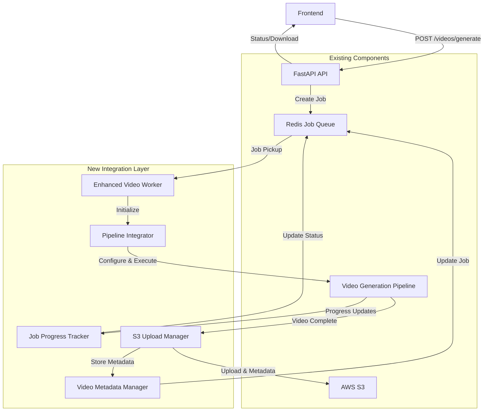

# Enhanced Video Workflow Design

## Overview

This design enhances the existing video generation system to provide seamless end-to-end workflow integration. The current system has all the necessary components (FastAPI backend, Redis job queue, video generation pipeline, AWS S3 integration, and background worker) but lacks proper integration between them. This enhancement will bridge these components to create a unified workflow: API request → job queue → video generation → S3 upload → metadata storage → URL serving.

The design maintains backward compatibility with all existing functionality while adding the missing integration layer to automate the complete video generation and delivery process.

## Architecture

### System Overview



### Component Architecture

The enhanced workflow introduces five new integration components that bridge the existing systems:

1. **Enhanced VideoWorker**: Orchestrates the complete workflow
2. **PipelineIntegrator**: Bridges worker and video generation pipeline
3. **JobProgressTracker**: Manages real-time progress updates
4. **S3UploadManager**: Handles automated S3 uploads with retry logic
5. **VideoMetadataManager**: Extracts and stores video metadata

## API Endpoints

### Enhanced Video API Endpoints

The design includes specific API endpoints to support the complete video workflow as defined in the requirements:

**Core Endpoints**:
- `POST /api/v1/videos/generate` - Create video generation job with immediate job tracking
- `GET /api/v1/videos/jobs/{job_id}/status` - Real-time job progress and stage information

**Video Access Endpoints**:
- `GET /api/v1/videos/jobs/{job_id}/download` - Stream video file with HTTP range request support
- `GET /api/v1/videos/jobs/{job_id}/stream` - Optimized video streaming with quality options
- `GET /api/v1/videos/jobs/{job_id}/metadata` - Complete video metadata including S3 URLs
- `GET /api/v1/videos/jobs/{job_id}/thumbnail` - Thumbnail image with caching headers

**Streaming Features**:
- **HTTP Range Requests**: Support for partial content delivery enabling efficient video streaming
- **Quality Options**: Multiple quality levels (720p, 1080p) for adaptive streaming
- **Caching Headers**: Appropriate cache-control headers for thumbnails and metadata
- **Signed URLs**: Secure access to S3-hosted content with time-limited URLs

## Components and Interfaces

### Enhanced VideoWorker

**Purpose**: Main orchestrator that processes jobs from the Redis queue and coordinates the complete workflow.

**Key Enhancements**:
- Replace simulation with real pipeline integration
- Add comprehensive error handling and retry logic
- Implement graceful shutdown and resource cleanup
- Support concurrent job processing with limits

**Interface**:
```python
class EnhancedVideoWorker:
    async def process_job(self, job_id: str) -> bool
    async def initialize_pipeline(self, job: Job) -> VideoGenerationOrchestrator
    async def handle_job_completion(self, job_id: str, result: VideoGenerationResult)
    async def handle_job_failure(self, job_id: str, error: Exception)
```

### PipelineIntegrator

**Purpose**: Bridges the worker process with the existing video generation pipeline (main.py functionality).

**Responsibilities**:
- Convert job configuration to pipeline configuration
- Initialize VideoGenerationOrchestrator with proper settings
- Set up progress callbacks for real-time updates
- Handle pipeline-specific error scenarios

**Interface**:
```python
class PipelineIntegrator:
    def create_pipeline_config(self, job: Job) -> VideoGenerationConfig
    async def execute_pipeline(self, config: VideoGenerationConfig) -> VideoGenerationResult
    def create_progress_callback(self, job_id: str) -> Callable
```

### JobProgressTracker

**Purpose**: Manages real-time progress updates from the video generation pipeline to Redis job storage.

**Responsibilities**:
- Receive progress callbacks from the pipeline
- Update job status, progress percentage, and current stage
- Handle atomic updates to prevent race conditions
- Provide consistent stage naming and progress mapping

**Interface**:
```python
class JobProgressTracker:
    async def update_progress(self, job_id: str, stage: str, percentage: float, message: str)
    async def mark_stage_complete(self, job_id: str, stage: str)
    async def handle_error(self, job_id: str, error: Exception, stage: str)
```

### S3UploadManager

**Purpose**: Manages automated upload of generated videos and thumbnails to AWS S3 with comprehensive error handling.

**Responsibilities**:
- Upload video files to appropriate S3 buckets
- Generate and upload thumbnail images
- Implement retry logic for failed uploads
- Create signed URLs for secure access
- Handle large file uploads with progress tracking

**Retry Logic**: Implements exactly 3 retry attempts with exponential backoff for failed uploads as specified in requirements.

**Interface**:
```python
class S3UploadManager:
    async def upload_video(self, video_path: str, job_id: str, user_id: str) -> S3UploadResult
    async def upload_thumbnails(self, thumbnail_paths: List[str], job_id: str, user_id: str) -> List[S3UploadResult]
    async def generate_signed_urls(self, s3_keys: List[str]) -> Dict[str, str]
    async def retry_upload(self, upload_func: Callable, max_attempts: int = 3) -> S3UploadResult
```

### VideoMetadataManager

**Purpose**: Extracts video metadata and stores it in Redis for API access.

**Responsibilities**:
- Extract technical metadata from generated videos
- Store video metadata with S3 URLs and access information
- Link metadata to job records for API retrieval
- Handle metadata updates and versioning

**Interface**:
```python
class VideoMetadataManager:
    async def extract_metadata(self, video_path: str) -> VideoTechnicalMetadata
    async def store_metadata(self, job_id: str, metadata: VideoMetadata, s3_urls: Dict[str, str])
    async def get_metadata(self, job_id: str) -> Optional[VideoMetadata]
```

## Data Models

### Enhanced Job Configuration

```python
class EnhancedJobConfiguration(JobConfiguration):
    # Existing fields from JobConfiguration
    # Additional fields for pipeline integration
    pipeline_version: str = "2.0"
    s3_upload_enabled: bool = True
    thumbnail_generation: bool = True
    cleanup_local_files: bool = True
    retry_attempts: int = 3
    quality_levels: List[str] = ["720p", "1080p"]
    enable_streaming: bool = True
```

### Video Generation Result

```python
class VideoGenerationResult:
    success: bool
    video_path: Optional[str]
    thumbnail_paths: List[str]
    metadata: Dict[str, Any]
    error: Optional[str]
    processing_time: float
    s3_upload_results: Optional[List[S3UploadResult]]
```

### S3 Upload Result

```python
class S3UploadResult:
    success: bool
    s3_key: str
    s3_url: str
    signed_url: str
    file_size: int
    upload_time: float
    error: Optional[str]
    retry_count: int
    quality_level: Optional[str]
```

### Video Metadata

```python
class VideoMetadata:
    job_id: str
    video_urls: Dict[str, str]  # quality -> URL mapping
    thumbnail_urls: List[str]
    technical_metadata: Dict[str, Any]
    streaming_info: Dict[str, Any]
    s3_keys: List[str]
    created_at: datetime
    file_size: int
    duration: float
    dimensions: Tuple[int, int]
```

## Error Handling

### Error Categories and Handling Strategy

1. **Pipeline Initialization Errors**
   - Invalid configuration parameters
   - Missing model dependencies
   - AWS credential issues
   - **Strategy**: Immediate job failure with detailed error message

2. **Video Generation Errors**
   - Model API failures
   - Content generation issues
   - Resource constraints
   - **Strategy**: Retry up to 3 times with exponential backoff

3. **S3 Upload Errors**
   - Network connectivity issues
   - Permission problems
   - Storage quota exceeded
   - **Strategy**: Retry exactly 3 times with exponential backoff, fallback to local storage

4. **Redis Update Errors**
   - Connection failures
   - Data serialization issues
   - **Strategy**: Retry with connection recovery, log for manual intervention

### Error Recovery Mechanisms

- **Automatic Retry**: Configurable retry attempts with exponential backoff
- **Graceful Degradation**: Continue processing even if non-critical operations fail
- **Error Reporting**: Comprehensive error logging with context for debugging
- **Manual Recovery**: Admin endpoints for reprocessing failed jobs

## Testing Strategy

### Unit Testing

- **Component Isolation**: Each new component tested independently
- **Mock Dependencies**: Mock Redis, S3, and pipeline dependencies
- **Error Scenarios**: Test all error conditions and recovery paths
- **Configuration Validation**: Test various configuration combinations

### Integration Testing

- **End-to-End Workflow**: Test complete workflow from API request to video delivery
- **Concurrent Processing**: Test multiple jobs processing simultaneously
- **Resource Management**: Test memory and storage cleanup
- **Error Propagation**: Test error handling across component boundaries

### Performance Testing

- **Load Testing**: Test system under high job volume
- **Memory Profiling**: Ensure no memory leaks in long-running workers
- **S3 Upload Performance**: Test large file upload efficiency
- **Redis Performance**: Test job queue performance under load

### Compatibility Testing

- **Backward Compatibility**: Ensure existing API endpoints continue to work
- **Configuration Compatibility**: Test with existing environment configurations
- **Data Migration**: Test with existing job data in Redis

## Deployment Considerations

### Environment Configuration

- **Shared Configuration**: Use same environment variables as existing components
- **Environment-Specific Settings**: Support development, staging, and production configurations
- **Secret Management**: Secure handling of AWS credentials and API keys

### Scaling Strategy

- **Horizontal Scaling**: Support multiple worker instances
- **Load Balancing**: Redis-based job distribution across workers
- **Resource Limits**: Configurable limits for concurrent jobs and memory usage
- **Auto-scaling**: Integration with container orchestration for dynamic scaling

### Monitoring and Observability

- **Health Checks**: Comprehensive health checks for all components
- **Metrics Collection**: Performance metrics for processing times and success rates
- **Logging Strategy**: Structured logging with correlation IDs for tracing
- **Alerting**: Alerts for job failures, queue backlog, and system errors

**Detailed Logging Requirements**:
- **Job Lifecycle**: Log all workflow stages with job_id, user_id, and timing information
- **Performance Metrics**: Record processing time, file sizes, and queue length metrics
- **Error Context**: Capture stack traces and context information for all errors
- **S3 Operations**: Log upload progress, success/failure status, and retry attempts
- **Queue Monitoring**: Track queue length and processing times for performance analysis

### Rollback Strategy

- **Feature Flags**: Ability to disable enhanced workflow and fall back to simulation
- **Data Compatibility**: Ensure job data remains compatible with previous versions
- **Graceful Shutdown**: Workers can complete current jobs before shutdown
- **Configuration Rollback**: Easy rollback of configuration changes