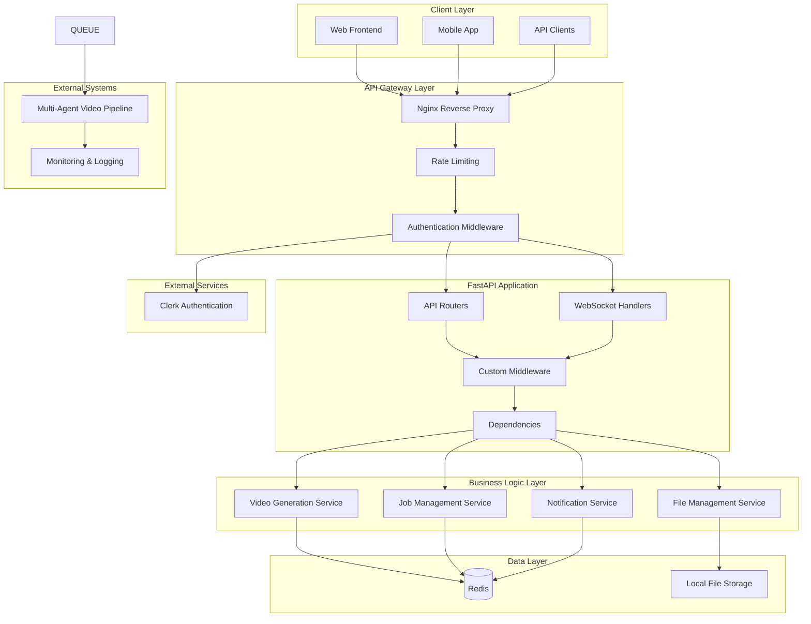

# Design Document

## Overview

This document outlines the design for a simplified FastAPI backend that serves as the primary interface for the multi-agent video generation system. The backend uses Pydantic for all data modeling and validation, Clerk for authentication, and Redis for both caching and job queuing. The design emphasizes simplicity and rapid development while maintaining clean architecture principles.

The system provides REST API endpoints for video generation requests and job management, with Redis handling both the job queue and caching layer. Authentication is managed entirely through Clerk, eliminating the need for custom user management.

## Architecture

### High-Level Architecture



### Project Structure

Simplified structure focusing on Pydantic models and Redis:

```
src/
├── app/
│   ├── main.py                    # FastAPI application entry point
│   ├── api/                       # API layer
│   │   ├── dependencies.py        # Shared dependencies (Clerk auth, Redis)
│   │   └── v1/                    # API version 1
│   │       ├── __init__.py
│   │       ├── videos.py          # Video generation endpoints
│   │       ├── jobs.py            # Job management endpoints
│   │       └── system.py          # System health endpoints
│   ├── core/                      # Core utilities and configurations
│   │   ├── config.py              # Application settings
│   │   ├── redis.py               # Redis connection and utilities
│   │   ├── auth.py                # Clerk authentication utilities
│   │   ├── logger.py              # Logging configuration
│   │   └── exceptions.py          # Custom exceptions
│   ├── services/                  # Business logic layer
│   │   ├── video_service.py       # Video generation business logic
│   │   ├── job_service.py         # Job management logic
│   │   └── queue_service.py       # Redis queue management
│   ├── models/                    # Pydantic models only
│   │   ├── __init__.py
│   │   ├── job.py                 # Job data models
│   │   ├── video.py               # Video metadata models
│   │   ├── user.py                # User data models (from Clerk)
│   │   └── system.py              # System status models
│   ├── middleware/                # Custom middleware
│   │   ├── __init__.py
│   │   ├── cors.py                # CORS middleware
│   │   ├── clerk_auth.py          # Clerk authentication middleware
│   │   └── error_handling.py      # Global error handling
│   └── utils/                     # Utility functions
│       ├── __init__.py
│       ├── file_utils.py          # File handling utilities
│       └── helpers.py             # General helper functions
├── tests/                         # Test suite
│   ├── conftest.py                # Test configuration
│   ├── test_api/                  # API endpoint tests
│   └── test_services/             # Service layer tests
└── scripts/                       # Utility scripts
    └── setup_redis.py             # Redis setup script
```

## Components and Interfaces

### API Layer Components

#### 1. Video Generation Router (`api/v1/videos.py`)

**Endpoints:**
- `POST /api/v1/videos/generate` - Submit video generation request
- `POST /api/v1/videos/batch` - Submit batch video generation requests
- `GET /api/v1/videos/jobs/{job_id}/status` - Get job status
- `GET /api/v1/videos/jobs/{job_id}/download` - Download completed video
- `GET /api/v1/videos/jobs/{job_id}/metadata` - Get job metadata

**Key Features:**
- Request validation using Pydantic schemas
- Async request handling
- Integration with job service
- File streaming for downloads
- Comprehensive error handling

#### 2. Job Management Router (`api/v1/jobs.py`)

**Endpoints:**
- `GET /api/v1/jobs` - List jobs with pagination and filtering
- `POST /api/v1/jobs/{job_id}/cancel` - Cancel job
- `DELETE /api/v1/jobs/{job_id}` - Delete job (soft delete)
- `GET /api/v1/jobs/{job_id}/logs` - Get job processing logs

**Key Features:**
- Pagination support using `fastcrud` patterns
- Advanced filtering and sorting
- Job lifecycle management
- Audit trail maintenance

#### 3. User Management Router (`api/v1/users.py`)

**Endpoints:**
- `POST /api/v1/users/register` - User registration
- `POST /api/v1/users/login` - User authentication
- `GET /api/v1/users/profile` - Get user profile
- `PUT /api/v1/users/profile` - Update user profile
- `POST /api/v1/users/verify-email` - Email verification
- `POST /api/v1/users/reset-password` - Password reset

**Key Features:**
- JWT-based authentication
- Email verification workflow
- Password reset functionality
- Profile management

#### 4. Subscription Management Router (`api/v1/subscriptions.py`)

**Endpoints:**
- `GET /api/v1/subscriptions/plans` - List available subscription plans
- `POST /api/v1/subscriptions/subscribe` - Create new subscription
- `GET /api/v1/subscriptions/current` - Get current user subscription
- `PUT /api/v1/subscriptions/upgrade` - Upgrade subscription plan
- `POST /api/v1/subscriptions/cancel` - Cancel subscription
- `GET /api/v1/subscriptions/usage` - Get usage statistics

**Key Features:**
- Subscription plan management
- Credit tracking and usage monitoring
- Billing integration
- Usage analytics

#### 5. WebSocket Handler (`api/v1/websockets.py`)

**Endpoints:**
- `WS /ws/jobs/{job_id}` - Real-time job status updates
- `WS /ws/system/health` - System health monitoring

**Key Features:**
- Connection management
- Real-time status broadcasting
- Graceful disconnection handling
- Authentication for WebSocket connections

### Service Layer Components

#### 1. Video Generation Service (`services/video_service.py`)

**Responsibilities:**
- Interface with multi-agent video generation pipeline
- Job queue management
- Configuration validation
- Progress tracking

**Key Methods:**
```python
async def create_video_job(request: VideoGenerationRequest) -> JobResponse
async def create_batch_jobs(requests: List[VideoGenerationRequest]) -> BatchJobResponse
async def get_job_status(job_id: str) -> JobStatus
async def cancel_job(job_id: str) -> bool
```

#### 2. Job Management Service (`services/job_service.py`)

**Responsibilities:**
- Job lifecycle management
- Status updates and notifications
- Resource allocation
- Performance monitoring

**Key Methods:**
```python
async def update_job_status(job_id: str, status: JobStatus, metadata: dict)
async def get_jobs_paginated(filters: JobFilters, pagination: PaginationParams) -> PaginatedResponse
async def cleanup_completed_jobs(retention_days: int)
```

#### 3. File Management Service (`services/file_service.py`)

**Responsibilities:**
- AWS S3 file upload/download handling
- Storage management with versioning
- Security scanning and validation
- Metadata extraction and storage

**Key Methods:**
```python
async def upload_to_s3(file: UploadFile, user_id: str, file_type: str) -> S3FileMetadata
async def download_from_s3(s3_key: str, bucket: str) -> StreamingResponse
async def generate_presigned_url(s3_key: str, expiration: int = 3600) -> str
async def validate_file(file: UploadFile) -> ValidationResult
async def cleanup_expired_files()
async def create_video_thumbnail(video_s3_key: str) -> str
```

#### 4. Subscription Service (`services/subscription_service.py`)

**Responsibilities:**
- Subscription lifecycle management
- Credit tracking and usage monitoring
- Billing integration
- Plan upgrade/downgrade logic

**Key Methods:**
```python
async def create_subscription(user_id: str, plan_id: int, payment_method: str) -> Subscription
async def check_user_credits(user_id: str) -> int
async def consume_credits(user_id: str, credits: int) -> bool
async def upgrade_subscription(user_id: str, new_plan_id: int) -> Subscription
async def cancel_subscription(user_id: str) -> bool
async def process_billing_cycle()
```

#### 5. AWS Integration Service (`services/aws_service.py`)

**Responsibilities:**
- AWS service integration and management
- DynamoDB operations for high-frequency data
- SQS queue management
- CloudWatch metrics and logging

**Key Methods:**
```python
async def put_job_status_dynamodb(job_id: str, status: dict)
async def get_job_status_history(job_id: str) -> List[dict]
async def send_sqs_message(queue_url: str, message: dict)
async def put_cloudwatch_metric(metric_name: str, value: float, dimensions: dict)
async def log_user_activity(user_id: str, activity: dict)
```

### Data Layer Components

#### Pydantic Data Models

**Job Model (`models/job.py`):**
```python
from pydantic import BaseModel, Field
from datetime import datetime
from enum import Enum
from typing import Optional, Dict, Any
import uuid

class JobStatus(str, Enum):
    QUEUED = "queued"
    PROCESSING = "processing"
    COMPLETED = "completed"
    FAILED = "failed"
    CANCELLED = "cancelled"

class JobCreate(BaseModel):
    topic: str = Field(..., min_length=1, max_length=500)
    context: str = Field(..., min_length=1, max_length=2000)
    model: Optional[str] = None
    quality: str = Field(default="medium")
    use_rag: bool = Field(default=False)
    configuration: Optional[Dict[str, Any]] = None

class Job(BaseModel):
    id: str = Field(default_factory=lambda: str(uuid.uuid4()))
    user_id: str  # Clerk user ID
    status: JobStatus = JobStatus.QUEUED
    job_type: str = "video_generation"
    configuration: Dict[str, Any]
    progress: float = Field(default=0.0, ge=0.0, le=100.0)
    error_message: Optional[str] = None
    created_at: datetime = Field(default_factory=datetime.utcnow)
    updated_at: datetime = Field(default_factory=datetime.utcnow)
    completed_at: Optional[datetime] = None

class JobResponse(BaseModel):
    job_id: str
    status: JobStatus
    progress: float
    created_at: datetime
    estimated_completion: Optional[datetime] = None
```

**Video Model (`models/video.py`):**
```python
from pydantic import BaseModel, Field
from datetime import datetime
from typing import Optional
import uuid

class VideoMetadata(BaseModel):
    id: str = Field(default_factory=lambda: str(uuid.uuid4()))
    job_id: str
    filename: str
    file_path: str
    file_size: int = Field(gt=0)
    duration: Optional[float] = Field(None, gt=0)
    resolution: Optional[str] = None
    format: str
    created_at: datetime = Field(default_factory=datetime.utcnow)

class VideoResponse(BaseModel):
    video_id: str
    job_id: str
    filename: str
    file_size: int
    duration: Optional[float]
    download_url: str
    created_at: datetime
```

#### Pydantic Schemas

**Request Schemas (`schemas/job.py`):**
```python
class VideoGenerationRequest(BaseModel):
    topic: str = Field(..., min_length=1, max_length=500)
    context: str = Field(..., min_length=1, max_length=2000)
    model: Optional[str] = Field(None, description="AI model to use")
    quality: VideoQuality = Field(VideoQuality.MEDIUM)
    use_rag: bool = Field(False)
    custom_config: Optional[Dict[str, Any]] = Field(None)
    
    model_config = ConfigDict(
        json_schema_extra={
            "example": {
                "topic": "Pythagorean Theorem",
                "context": "Explain the mathematical proof with visual demonstration",
                "model": "gemini/gemini-2.5-flash-preview-04-17",
                "quality": "medium",
                "use_rag": True
            }
        }
    )
```

**Response Schemas:**
```python
class JobResponse(BaseModel):
    job_id: str
    status: JobStatus
    created_at: datetime
    estimated_completion: Optional[datetime] = None
    
class JobStatusResponse(BaseModel):
    job_id: str
    status: JobStatus
    progress: float
    current_stage: Optional[str] = None
    error_message: Optional[str] = None
    created_at: datetime
    updated_at: datetime
    completed_at: Optional[datetime] = None
```

## Data Models

### Core Entities

#### Job Entity
- **Primary Key:** UUID string
- **Status:** Enum (queued, processing, completed, failed, cancelled)
- **Configuration:** JSON field for flexible job parameters
- **Progress Tracking:** Float percentage and current stage
- **Audit Fields:** Created, updated, completed timestamps
- **Soft Delete:** Support for data retention policies

#### User Entity
- **Authentication:** JWT-based authentication
- **Authorization:** Role-based access control
- **Rate Limiting:** Per-user request limits
- **Audit Trail:** Request logging and monitoring

#### Video Entity
- **Metadata:** File size, duration, resolution, format
- **Storage:** File path and storage location
- **Relationships:** Linked to originating job
- **Lifecycle:** Automatic cleanup policies

### Redis Data Structure Design

#### Redis Keys and Data Types

**Job Storage (Hash):**
```
jobs:{job_id} -> Hash
{
  "id": "uuid",
  "user_id": "clerk_user_id", 
  "status": "queued|processing|completed|failed|cancelled",
  "job_type": "video_generation",
  "configuration": "json_string",
  "progress": "0.0-100.0",
  "error_message": "optional_error",
  "created_at": "iso_datetime",
  "updated_at": "iso_datetime",
  "completed_at": "optional_iso_datetime"
}
```

**Job Queue (List):**
```
job_queue -> List
["job_id_1", "job_id_2", "job_id_3", ...]
```

**User Jobs Index (Set):**
```
user_jobs:{user_id} -> Set
{"job_id_1", "job_id_2", "job_id_3", ...}
```

**Video Metadata (Hash):**
```
videos:{video_id} -> Hash
{
  "id": "uuid",
  "job_id": "job_uuid",
  "filename": "video.mp4",
  "file_path": "/path/to/video.mp4",
  "file_size": "bytes",
  "duration": "seconds",
  "resolution": "1920x1080",
  "format": "mp4",
  "created_at": "iso_datetime"
}
```

**Job Status Cache (String with TTL):**
```
job_status:{job_id} -> String (TTL: 300 seconds)
"processing" | "completed" | "failed"
```

**System Health (Hash):**
```
system:health -> Hash
{
  "redis": "healthy",
  "queue_length": "5",
  "active_jobs": "3",
  "last_check": "iso_datetime"
}
```

## Error Handling

### Exception Hierarchy

```python
class APIException(Exception):
    """Base API exception"""
    def __init__(self, message: str, status_code: int = 500, error_code: str = None):
        self.message = message
        self.status_code = status_code
        self.error_code = error_code

class ValidationException(APIException):
    """Request validation errors"""
    def __init__(self, message: str, field_errors: List[dict] = None):
        super().__init__(message, 422, "VALIDATION_ERROR")
        self.field_errors = field_errors or []

class NotFoundException(APIException):
    """Resource not found"""
    def __init__(self, resource: str):
        super().__init__(f"{resource} not found", 404, "NOT_FOUND")

class ConflictException(APIException):
    """Resource conflict"""
    def __init__(self, message: str):
        super().__init__(message, 409, "CONFLICT")

class RateLimitException(APIException):
    """Rate limit exceeded"""
    def __init__(self, retry_after: int = None):
        super().__init__("Rate limit exceeded", 429, "RATE_LIMIT_EXCEEDED")
        self.retry_after = retry_after
```

### Global Error Handler

```python
@app.exception_handler(APIException)
async def api_exception_handler(request: Request, exc: APIException):
    return JSONResponse(
        status_code=exc.status_code,
        content={
            "error": {
                "message": exc.message,
                "error_code": exc.error_code,
                "timestamp": datetime.utcnow().isoformat(),
                "path": str(request.url.path)
            }
        }
    )

@app.exception_handler(ValidationError)
async def validation_exception_handler(request: Request, exc: ValidationError):
    return JSONResponse(
        status_code=422,
        content={
            "error": {
                "message": "Validation failed",
                "error_code": "VALIDATION_ERROR",
                "details": exc.errors(),
                "timestamp": datetime.utcnow().isoformat(),
                "path": str(request.url.path)
            }
        }
    )
```

### Error Response Format

All error responses follow a consistent structure:

```json
{
  "error": {
    "message": "Human-readable error message",
    "error_code": "MACHINE_READABLE_CODE",
    "details": {},
    "timestamp": "2024-01-15T10:30:00Z",
    "path": "/api/v1/videos/generate"
  }
}
```

## Testing Strategy

### Testing Pyramid

#### Unit Tests (70%)
- **Service Layer:** Business logic validation
- **CRUD Operations:** Database interaction testing
- **Utility Functions:** Helper function validation
- **Schema Validation:** Pydantic model testing

#### Integration Tests (20%)
- **API Endpoints:** Full request/response cycle
- **Database Integration:** Real database operations
- **External Service Integration:** Mock external dependencies
- **WebSocket Connections:** Real-time communication testing

#### End-to-End Tests (10%)
- **Complete Workflows:** Full video generation pipeline
- **User Journeys:** Multi-step user interactions
- **Performance Testing:** Load and stress testing
- **Security Testing:** Authentication and authorization

### Test Configuration

```python
# conftest.py
@pytest.fixture
async def test_db():
    """Create test database session"""
    engine = create_async_engine(TEST_DATABASE_URL)
    async with engine.begin() as conn:
        await conn.run_sync(Base.metadata.create_all)
    
    async_session = async_sessionmaker(engine, expire_on_commit=False)
    async with async_session() as session:
        yield session
    
    async with engine.begin() as conn:
        await conn.run_sync(Base.metadata.drop_all)

@pytest.fixture
def test_client():
    """Create test client"""
    return TestClient(app)

@pytest.fixture
async def authenticated_user(test_db):
    """Create authenticated test user"""
    user = await crud_users.create(
        db=test_db,
        object=UserCreate(
            username="testuser",
            email="test@example.com",
            password="testpass123"
        )
    )
    return user
```

### Test Examples

```python
# Test API endpoint
async def test_create_video_job(test_client, authenticated_user):
    request_data = {
        "topic": "Test Topic",
        "context": "Test context for video generation",
        "quality": "medium"
    }
    
    response = test_client.post(
        "/api/v1/videos/generate",
        json=request_data,
        headers={"Authorization": f"Bearer {authenticated_user.token}"}
    )
    
    assert response.status_code == 201
    data = response.json()
    assert "job_id" in data
    assert data["status"] == "queued"

# Test service layer
async def test_video_service_create_job(test_db):
    service = VideoService(test_db)
    request = VideoGenerationRequest(
        topic="Test Topic",
        context="Test context"
    )
    
    job = await service.create_video_job(request, user_id=1)
    
    assert job.status == JobStatus.QUEUED
    assert job.configuration["topic"] == "Test Topic"
```

## Security Considerations

### Authentication & Authorization

#### JWT Token-Based Authentication
- **Access Tokens:** Short-lived (15 minutes) for API access
- **Refresh Tokens:** Long-lived (7 days) for token renewal
- **Token Blacklisting:** Support for immediate token revocation
- **Secure Storage:** HttpOnly cookies for web clients

#### Role-Based Access Control (RBAC)
- **User Roles:** admin, user, readonly
- **Permission System:** Granular permissions for different operations
- **Resource Ownership:** Users can only access their own resources
- **Admin Override:** Administrators can access all resources

### Input Validation & Sanitization

#### Request Validation
- **Pydantic Models:** Automatic type validation and conversion
- **Field Constraints:** Length limits, format validation, range checks
- **Custom Validators:** Business rule validation
- **Sanitization:** XSS prevention and input cleaning

#### File Upload Security
- **File Type Validation:** Whitelist of allowed file types
- **Size Limits:** Maximum file size enforcement
- **Virus Scanning:** Integration with antivirus services
- **Secure Storage:** Isolated file storage with access controls

### Rate Limiting & DDoS Protection

#### Multi-Level Rate Limiting
- **Global Limits:** Overall API request limits
- **Per-User Limits:** Individual user quotas
- **Per-Endpoint Limits:** Specific endpoint restrictions
- **Sliding Window:** Advanced rate limiting algorithms

#### Implementation Strategy
```python
from slowapi import Limiter, _rate_limit_exceeded_handler
from slowapi.util import get_remote_address

limiter = Limiter(key_func=get_remote_address)

@app.route("/api/v1/videos/generate")
@limiter.limit("10/minute")
async def generate_video(request: Request):
    # Endpoint implementation
    pass
```

### Data Protection

#### Encryption
- **Data at Rest:** Database encryption for sensitive fields
- **Data in Transit:** TLS 1.3 for all communications
- **File Encryption:** Encrypted file storage
- **Key Management:** Secure key rotation policies

#### Privacy Compliance
- **Data Minimization:** Collect only necessary data
- **Retention Policies:** Automatic data cleanup
- **User Rights:** Data export and deletion capabilities
- **Audit Logging:** Comprehensive access logging

## Performance Optimization

### Caching Strategy

#### Multi-Level Caching
- **Application Cache:** In-memory caching with Redis
- **Database Query Cache:** SQLAlchemy query result caching
- **HTTP Response Cache:** CDN and browser caching
- **File System Cache:** Temporary file caching

#### Cache Implementation
```python
from fastapi_cache.decorator import cache

@router.get("/api/v1/jobs/{job_id}/status")
@cache(expire=30)  # Cache for 30 seconds
async def get_job_status(job_id: str):
    return await job_service.get_status(job_id)
```

### Database Optimization

#### Query Optimization
- **Eager Loading:** Reduce N+1 query problems
- **Indexing Strategy:** Optimized database indexes
- **Connection Pooling:** Efficient database connections
- **Query Monitoring:** Performance tracking and optimization

#### Pagination & Filtering
```python
async def get_jobs_paginated(
    page: int = 1,
    items_per_page: int = 10,
    filters: JobFilters = None
) -> PaginatedResponse:
    offset = (page - 1) * items_per_page
    
    query = select(Job).where(Job.is_deleted == False)
    if filters:
        query = apply_filters(query, filters)
    
    total = await db.scalar(select(func.count()).select_from(query.subquery()))
    jobs = await db.execute(query.offset(offset).limit(items_per_page))
    
    return PaginatedResponse(
        data=jobs.scalars().all(),
        total_count=total,
        page=page,
        items_per_page=items_per_page
    )
```

### Asynchronous Processing

#### Background Tasks
- **Celery Integration:** Distributed task processing
- **Job Queues:** Redis-based task queuing
- **Progress Tracking:** Real-time progress updates
- **Error Recovery:** Automatic retry mechanisms

#### WebSocket Optimization
- **Connection Pooling:** Efficient WebSocket management
- **Message Broadcasting:** Efficient multi-client updates
- **Heartbeat Monitoring:** Connection health checks
- **Graceful Degradation:** Fallback to polling if needed

## Monitoring & Observability

### Logging Strategy

#### Structured Logging
```python
import structlog

logger = structlog.get_logger()

async def create_video_job(request: VideoGenerationRequest, user_id: int):
    logger.info(
        "Creating video job",
        user_id=user_id,
        topic=request.topic,
        quality=request.quality
    )
    
    try:
        job = await video_service.create_job(request, user_id)
        logger.info("Video job created successfully", job_id=job.id)
        return job
    except Exception as e:
        logger.error(
            "Failed to create video job",
            user_id=user_id,
            error=str(e),
            exc_info=True
        )
        raise
```

### Metrics Collection

#### Application Metrics
- **Request Metrics:** Response times, status codes, throughput
- **Business Metrics:** Job completion rates, user activity
- **System Metrics:** CPU, memory, disk usage
- **Custom Metrics:** Domain-specific measurements

#### Health Checks
```python
@router.get("/health")
async def health_check():
    checks = {
        "database": await check_database_health(),
        "redis": await check_redis_health(),
        "queue": await check_queue_health(),
        "storage": await check_storage_health()
    }
    
    overall_health = all(checks.values())
    status_code = 200 if overall_health else 503
    
    return JSONResponse(
        status_code=status_code,
        content={
            "status": "healthy" if overall_health else "unhealthy",
            "checks": checks,
            "timestamp": datetime.utcnow().isoformat()
        }
    )
```

### Distributed Tracing

#### OpenTelemetry Integration
- **Request Tracing:** End-to-end request tracking
- **Service Dependencies:** Inter-service communication mapping
- **Performance Analysis:** Bottleneck identification
- **Error Correlation:** Error tracking across services

## Deployment Architecture

### Container Strategy

#### Docker Configuration
```dockerfile
FROM python:3.11-slim

WORKDIR /app

# Install system dependencies
RUN apt-get update && apt-get install -y \
    gcc \
    && rm -rf /var/lib/apt/lists/*

# Install Python dependencies
COPY requirements.txt .
RUN pip install --no-cache-dir -r requirements.txt

# Copy application code
COPY src/ ./src/
COPY migrations/ ./migrations/

# Set environment variables
ENV PYTHONPATH=/app/src
ENV PYTHONUNBUFFERED=1

# Expose port
EXPOSE 8000

# Run application
CMD ["uvicorn", "app.main:app", "--host", "0.0.0.0", "--port", "8000"]
```

#### AWS Deployment Configuration

**AWS Services Integration:**
- **RDS PostgreSQL:** Primary relational database for user data, jobs, subscriptions
- **DynamoDB:** High-frequency data like job status updates, user activity tracking
- **S3:** Video files, thumbnails, job outputs, user uploads
- **ElastiCache Redis:** Session storage, caching, real-time data
- **SQS:** Job queue management and inter-service communication
- **CloudFront:** CDN for video delivery and static assets
- **Lambda:** Serverless functions for background processing
- **ECS/Fargate:** Container orchestration for API services

**Docker Compose for Local Development:**
```yaml
version: '3.8'

services:
  api:
    build: .
    ports:
      - "8000:8000"
    environment:
      - AWS_REGION=us-east-1
      - AWS_ACCESS_KEY_ID=${AWS_ACCESS_KEY_ID}
      - AWS_SECRET_ACCESS_KEY=${AWS_SECRET_ACCESS_KEY}
      - DATABASE_URL=${RDS_DATABASE_URL}
      - REDIS_URL=${ELASTICACHE_URL}
      - S3_BUCKET=${S3_BUCKET_NAME}
      - SQS_QUEUE_URL=${SQS_QUEUE_URL}
      - DYNAMODB_TABLE_PREFIX=${DYNAMODB_PREFIX}
    volumes:
      - ./logs:/app/logs
      - ~/.aws:/root/.aws:ro

  localstack:
    image: localstack/localstack:latest
    ports:
      - "4566:4566"
    environment:
      - SERVICES=s3,sqs,dynamodb,elasticache
      - DEBUG=1
      - DATA_DIR=/tmp/localstack/data
    volumes:
      - localstack_data:/tmp/localstack

  postgres:
    image: postgres:15
    environment:
      - POSTGRES_DB=videoapi_local
      - POSTGRES_USER=user
      - POSTGRES_PASSWORD=pass
    volumes:
      - postgres_data:/var/lib/postgresql/data
    ports:
      - "5432:5432"

volumes:
  postgres_data:
  localstack_data:
```

**AWS CDK/Terraform Infrastructure:**
```typescript
// AWS CDK example structure
export class VideoAPIStack extends Stack {
  constructor(scope: Construct, id: string, props?: StackProps) {
    super(scope, id, props);

    // RDS PostgreSQL
    const database = new rds.DatabaseInstance(this, 'VideoAPIDB', {
      engine: rds.DatabaseInstanceEngine.postgres({
        version: rds.PostgresEngineVersion.VER_15
      }),
      instanceType: ec2.InstanceType.of(ec2.InstanceClass.T3, ec2.InstanceSize.MICRO),
      multiAz: true,
      backupRetention: Duration.days(7)
    });

    // S3 Buckets
    const videoBucket = new s3.Bucket(this, 'VideoBucket', {
      versioned: true,
      lifecycleRules: [{
        id: 'DeleteOldVersions',
        expiration: Duration.days(90)
      }]
    });

    // DynamoDB Tables
    const jobStatusTable = new dynamodb.Table(this, 'JobStatusTable', {
      partitionKey: { name: 'job_id', type: dynamodb.AttributeType.STRING },
      sortKey: { name: 'timestamp', type: dynamodb.AttributeType.NUMBER },
      timeToLiveAttribute: 'ttl'
    });

    // ECS Fargate Service
    const cluster = new ecs.Cluster(this, 'VideoAPICluster');
    const taskDefinition = new ecs.FargateTaskDefinition(this, 'VideoAPITask');
    
    const container = taskDefinition.addContainer('api', {
      image: ecs.ContainerImage.fromRegistry('your-api-image'),
      environment: {
        DATABASE_URL: database.instanceEndpoint.socketAddress,
        S3_BUCKET: videoBucket.bucketName
      }
    });

    new ecs.FargateService(this, 'VideoAPIService', {
      cluster,
      taskDefinition,
      desiredCount: 2
    });
  }
}
```

### Production Considerations

#### Scalability
- **Horizontal Scaling:** Multiple API instances behind load balancer
- **Database Scaling:** Read replicas and connection pooling
- **Cache Scaling:** Redis clustering for high availability
- **File Storage:** Distributed storage solutions

#### Security Hardening
- **SSL/TLS:** End-to-end encryption
- **Firewall Rules:** Network access restrictions
- **Secret Management:** Secure credential storage
- **Regular Updates:** Security patch management

#### Monitoring & Alerting
- **Application Monitoring:** APM tools integration
- **Infrastructure Monitoring:** System metrics collection
- **Log Aggregation:** Centralized logging solution
- **Alert Management:** Proactive issue notification