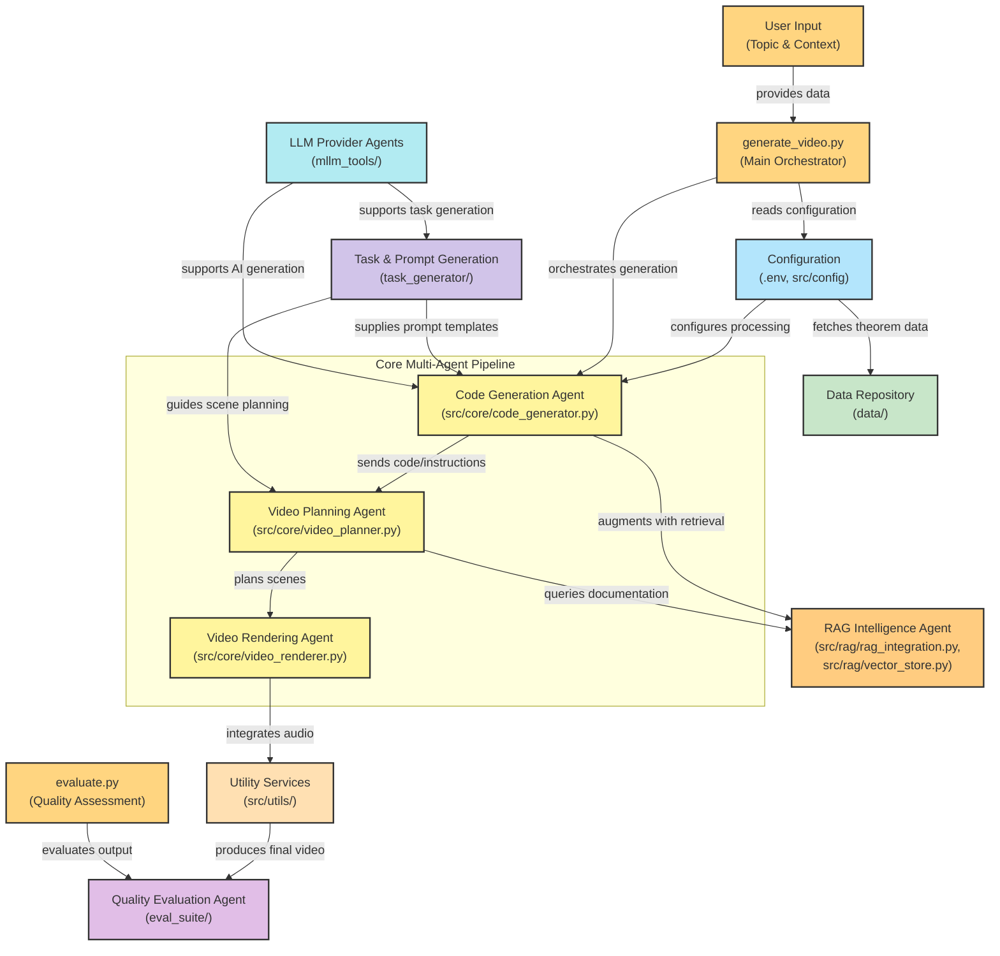

# Multi-Agent Video Generation System - Architecture Overview

## 🎯 System Purpose
This is a sophisticated **multi-agent system** that automatically generates educational videos using Manim (Mathematical Animation Engine). The system transforms textual descriptions of mathematical concepts, theorems, and educational content into high-quality animated videos through coordinated AI agents.

## 🏗️ System Architecture



## 🤖 Core Agents & Responsibilities

### 1. **🎬 Video Planning Agent** (`src/core/video_planner.py`)
**Role**: Strategic planning and scene orchestration

**Key Capabilities**:
- Scene outline generation and decomposition
- Storyboard creation with visual descriptions
- Technical implementation planning
- Concurrent scene processing with enhanced parallelization
- Context learning from previous examples
- RAG integration for Manim documentation retrieval

**Key Methods**:
- `generate_scene_outline()` - Creates overall video structure
- `generate_scene_implementation_concurrently_enhanced()` - Parallel scene planning
- `_initialize_context_examples()` - Loads learning contexts

### 2. **⚡ Code Generation Agent** (`src/core/code_generator.py`)
**Role**: Manim code synthesis and optimization

**Key Capabilities**:
- Intelligent Manim code generation from scene descriptions
- Automatic error detection and fixing
- Visual self-reflection for code quality
- RAG-enhanced code generation with documentation context
- Context learning from successful examples
- Banned reasoning prevention

**Key Methods**:
- `generate_manim_code()` - Primary code generation
- `fix_code_errors()` - Intelligent error correction
- `visual_self_reflection()` - Quality validation

### 3. **🎞️ Video Rendering Agent** (`src/core/video_renderer.py`)
**Role**: Video compilation and optimization

**Key Capabilities**:
- Optimized Manim scene rendering
- Intelligent caching system for performance
- Parallel scene processing
- Quality preset management (preview/low/medium/high/production)
- GPU acceleration support
- Video combination and assembly

**Key Methods**:
- `render_scene_optimized()` - Enhanced scene rendering
- `combine_videos_optimized()` - Final video assembly
- `_get_code_hash()` - Intelligent caching

### 4. **🔍 RAG Intelligence Agent** (`src/rag/rag_integration.py`, `src/rag/vector_store.py`)
**Role**: Knowledge retrieval and context augmentation

**Key Capabilities**:
- Manim documentation retrieval
- Plugin detection and relevance scoring
- Vector store management with ChromaDB
- Query generation for technical contexts
- Enhanced document embedding and retrieval

**Key Methods**:
- `detect_relevant_plugins()` - Smart plugin identification
- `retrieve_relevant_docs()` - Context-aware documentation retrieval
- `generate_rag_queries()` - Intelligent query formulation

### 5. **📝 Task & Prompt Generation Service** (`task_generator/`)
**Role**: Template management and prompt engineering

**Key Capabilities**:
- Dynamic prompt template generation
- Context-aware prompt customization
- Banned reasoning pattern management
- Multi-modal prompt support

**Key Components**:
- `parse_prompt.py` - Template processing
- `prompts_raw/` - Prompt template repository

### 6. **🤖 LLM Provider Agents** (`mllm_tools/`)
**Role**: AI model abstraction and management

**Key Capabilities**:
- Multi-provider LLM support (OpenAI, Gemini, Vertex AI, OpenRouter)
- Unified interface for different AI models
- Cost tracking and usage monitoring
- Langfuse integration for observability

**Key Components**:
- `litellm.py` - LiteLLM wrapper for multiple providers
- `openrouter.py` - OpenRouter integration
- `gemini.py` - Google Gemini integration
- `vertex_ai.py` - Google Cloud Vertex AI

### 7. **✅ Quality Evaluation Agent** (`eval_suite/`)
**Role**: Output validation and quality assurance

**Key Capabilities**:
- Multi-modal content evaluation (text, image, video)
- Automated quality scoring
- Error pattern detection
- Performance metrics collection

**Key Components**:
- `text_utils.py` - Text quality evaluation
- `image_utils.py` - Visual content assessment
- `video_utils.py` - Video quality metrics

## 🔄 Multi-Agent Workflow

### **Phase 1: Initialization & Planning**
1. **System Orchestrator** (`generate_video.py`) receives user input
2. **Configuration Manager** loads system settings and model configurations
3. **Session Manager** creates/loads session for continuity
4. **Video Planning Agent** analyzes topic and creates scene breakdown
5. **RAG Agent** detects relevant plugins and retrieves documentation

### **Phase 2: Implementation Planning**
1. **Video Planning Agent** generates detailed implementation plans for each scene
2. **Task Generator** provides appropriate prompt templates
3. **RAG Agent** augments plans with relevant technical documentation
4. **Scene Analyzer** validates plan completeness

### **Phase 3: Code Generation**
1. **Code Generation Agent** transforms scene plans into Manim code
2. **RAG Agent** provides contextual documentation for complex animations
3. **Error Detection** validates code syntax and logic
4. **Quality Assurance** ensures code meets standards

### **Phase 4: Rendering & Assembly**
1. **Video Rendering Agent** executes Manim code to generate scenes
2. **Caching System** optimizes performance through intelligent storage
3. **Parallel Processing** renders multiple scenes concurrently
4. **Quality Control** validates rendered output

### **Phase 5: Final Assembly**
1. **Video Rendering Agent** combines individual scenes
2. **Audio Integration** adds voiceovers and sound effects
3. **Quality Evaluation Agent** performs final validation
4. **Output Manager** delivers final video with metadata

## 🏛️ Design Principles

### **SOLID Principles Implementation**

1. **Single Responsibility Principle**
   - Each agent has a focused, well-defined purpose
   - Clear separation of concerns across components

2. **Open/Closed Principle**
   - System extensible through composition and interfaces
   - New agents can be added without modifying existing code

3. **Liskov Substitution Principle**
   - Agents implement common interfaces for interchangeability
   - Protocol-based design ensures compatibility

4. **Interface Segregation Principle**
   - Clean, focused interfaces for agent communication
   - No forced dependencies on unused functionality

5. **Dependency Inversion Principle**
   - High-level modules depend on abstractions
   - Factory pattern for component creation

### **Multi-Agent Coordination Patterns**

1. **Pipeline Architecture**: Sequential processing with clear handoffs
2. **Publish-Subscribe**: Event-driven communication between agents
3. **Factory Pattern**: Dynamic agent creation and configuration
4. **Strategy Pattern**: Pluggable algorithms for different tasks
5. **Observer Pattern**: Monitoring and logging across agents

## ⚡ Performance Optimizations

### **Concurrency & Parallelization**
- **Async/Await**: Non-blocking agent coordination
- **Semaphore Control**: Intelligent resource management
- **Thread Pools**: Parallel I/O operations
- **Concurrent Scene Processing**: Multiple scenes rendered simultaneously

### **Intelligent Caching**
- **Code Hash-based Caching**: Avoid redundant renders
- **Context Caching**: Reuse prompt templates and examples
- **Vector Store Caching**: Optimized document retrieval

### **Resource Management**
- **GPU Acceleration**: Hardware-accelerated rendering
- **Memory Optimization**: Efficient data structures
- **Quality Presets**: Speed vs. quality tradeoffs

## 🔧 Configuration Management

### **Environment Configuration** (`.env`, `src/config/config.py`)
```python
class VideoGenerationConfig:
    planner_model: str                    # Primary AI model
    scene_model: Optional[str] = None     # Scene-specific model
    helper_model: Optional[str] = None    # Helper tasks model
    max_scene_concurrency: int = 5        # Parallel scene limit
    use_rag: bool = False                 # RAG integration
    enable_caching: bool = True           # Performance caching
    use_gpu_acceleration: bool = False    # Hardware acceleration
```

### **Model Provider Configuration**
- Support for multiple LLM providers (OpenAI, Gemini, Claude, etc.)
- Unified interface through LiteLLM
- Cost tracking and usage monitoring
- Automatic failover capabilities

## 📊 Data Flow Architecture

### **Input Data Sources**
- **Theorem Datasets**: JSON files with mathematical concepts (`data/thb_*/`)
- **Context Learning**: Historical examples (`data/context_learning/`)
- **RAG Documentation**: Manim docs and plugins (`data/rag/manim_docs/`)

### **Processing Pipeline**
```
User Input → Topic Analysis → Scene Planning → Code Generation → Rendering → Quality Check → Final Output
     ↓              ↓              ↓              ↓              ↓              ↓
Configuration → RAG Context → Implementation → Error Fixing → Optimization → Validation
```

### **Output Artifacts**
- **Scene Outlines**: Structured video plans
- **Implementation Plans**: Technical specifications
- **Manim Code**: Executable animation scripts
- **Rendered Videos**: Individual scene outputs
- **Combined Videos**: Final assembled content
- **Metadata**: Processing logs and metrics

## 🎪 Advanced Features

### **Error Recovery & Self-Healing**
- **Multi-layer Retry Logic**: Automatic error recovery at each agent level
- **Intelligent Error Analysis**: Pattern recognition for common failures
- **Self-Reflection**: Code quality validation through visual analysis
- **Fallback Strategies**: Alternative approaches when primary methods fail

### **Monitoring & Observability**
- **Langfuse Integration**: Comprehensive LLM call tracking
- **Performance Metrics**: Render times, success rates, resource usage
- **Status Dashboard**: Real-time pipeline state visualization
- **Cost Tracking**: Token usage and API cost monitoring

### **Scalability Features**
- **Horizontal Scaling**: Multiple concurrent topic processing
- **Resource Pooling**: Shared computational resources
- **Load Balancing**: Intelligent task distribution
- **State Persistence**: Resume interrupted processing

## 🚀 Usage Examples

### **Single Topic Generation**
```bash
python generate_video.py \
    --topic "Pythagorean Theorem" \
    --context "Explain the mathematical proof and visual demonstration" \
    --model "gemini/gemini-2.5-flash-preview-04-17" \
    --use_rag \
    --quality medium
```

### **Batch Processing**
```bash
python generate_video.py \
    --theorems_path data/thb_easy/math.json \
    --sample_size 5 \
    --max_scene_concurrency 3 \
    --use_context_learning \
    --enable_caching
```

### **Status Monitoring**
```bash
python generate_video.py \
    --theorems_path data/thb_easy/math.json \
    --check_status
```

## 📈 System Metrics & KPIs

### **Performance Indicators**
- **Scene Generation Speed**: Average time per scene
- **Rendering Efficiency**: Cache hit rates and parallel utilization
- **Quality Scores**: Automated evaluation metrics
- **Success Rates**: Completion percentage across pipeline stages

### **Resource Utilization**
- **LLM Token Usage**: Cost optimization and efficiency
- **Computational Resources**: CPU/GPU utilization
- **Storage Efficiency**: Cache effectiveness and data management
- **Memory Footprint**: System resource consumption

## 🔮 Future Enhancements

### **Planned Agent Improvements**
- **Advanced Visual Agent**: Enhanced image understanding and generation
- **Audio Synthesis Agent**: Dynamic voiceover generation
- **Interactive Agent**: Real-time user feedback integration
- **Curriculum Agent**: Adaptive learning path generation

### **Technical Roadmap**
- **Distributed Processing**: Multi-node agent deployment
- **Real-time Streaming**: Live video generation capabilities
- **Mobile Integration**: Responsive design for mobile platforms
- **API Gateway**: RESTful service architecture

---

## 📚 Related Documentation

- **[API Reference](docs/api_reference.md)** - Detailed method documentation
- **[Configuration Guide](docs/configuration.md)** - Setup and customization
- **[Development Guide](docs/development.md)** - Contributing and extending
- **[Troubleshooting](docs/troubleshooting.md)** - Common issues and solutions

---

**Last Updated**: August 25, 2025  
**Version**: Multi-Agent Enhanced Pipeline v2.0  
**Maintainer**: T2M Development Team
